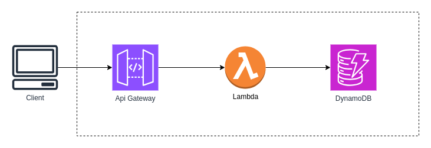

# Serverless with Go

A simple API for creating tasks

## Lambda
- **Create**: Creates a task and puts it into DynamoDB
- **FindTask**: Retrieves a task from DynamoDB based on keys

## DynamoDB
Tablename: tasks

|id|title|description|completed|
|---|---|---|---|

## Api Gateway
- Path /task-api/task:
    - GET
    - POST

## Terraform resources
- Lambda function
- Zip source code
- DynamoDB table
- Api Gateway
- Policies:
    - sts:AssumeRole
    - logs:CreateLogGroup
    - logs:CreateLogStream
    - logs:PutLogEvents
    - dynamodb:PutItem
    - dynamodb:GetItem
    - lambda:InvokeFunction

